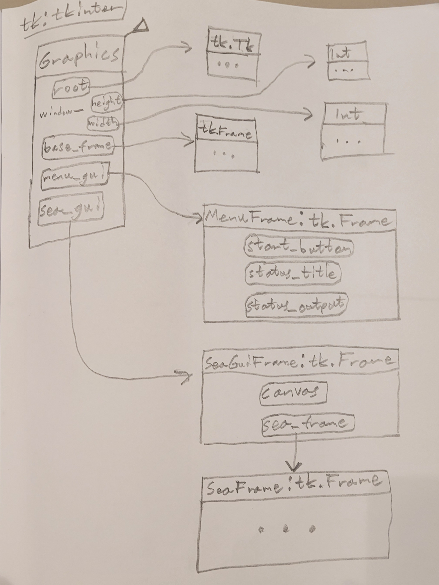

# Specifikation
## Inledning

Projektet är ett program som beräknar den snabbaste seglatsen mellan två positioner genom ett hav  
uppbyggt av diskreta rutor med individuella egenskaper.  
Varje ruta har en specifik vindriktning och -hastighet.  
Dessa avgör hur snabbt segelbåten kan segla i en viss riktning.  

Simuleringen ska kontrolleras och visuellt representeras genom ett grafiskt användargränssnitt.  
En meny med start-knapp och resultat till vänster, samt en schackbrädesliknande figur med havets  
alla rutor till höger.  

Beräkningarna ska testa alla möjliga rutter mellan två utvalda rutor och svara med vilken som var snabbast.  
En sådan uppgift lämpar sig väl för en lösning med rekursion eftersom alla möjliga reseriktningar ska  
testas utifrån varje ruta båten besöker. Detta kan vara en av de största utmaningarna då rekursion i  
vissa fall kan vara svårt att greppa och förstå intuitivt.  

Dessutom kan väldigt stora matriser bli väldigt beräkningsintensiva och optimeringar av algoritmen  
kommer att krävas för att få några resultat inom rimlig tid.

## Användarscenarier

### Seglats

Segelbåten måste hinna till sin destination innan kl. 19. Båten matar in uppmätt vinddata i en matris och  
startar programmet. Den vänsterklickar på rutan som representerar dess utgångspunkt och högerklickar  
sedan på sitt mål. Då lyser calculate-knappen grönt och båten klickar på den. Den optimala seglatsen  
visas på skärmen samt en ungefärlig tidsåtgång.

### Arkadspel

Spelaren spelar ett arkadspel som handlar om att man ska guida en segelbåt genom ett diskret rutnät  
med specifik och konstant vindhastighet och -riktning i varje ruta. Spelaren känner för att fuska lite istället  
för att försöka själv och följer samma procedur som segelbåten, får den optimala rutten och vinner spelet.

### Att ha tråkigt

Den uttråkade sitter vid datorn utan att ha något att göra. För att stimuleras lite grann öppnar den  
seglatsprogrammet. Några rutor klickas på och datorns fläktar når 2000 rpm. Snart finns en lång  
och komplicerad rutt på skärmen. Den uttråkade är inte längre lika uttråkad. 

## Programskelett

Dessa kommentarer antar i princip att man vet hur programmet ser ut när man startar det.

```
class Controller:
    """Controller-klassen hanterar hela programmet och skapar de mest grundläggande komponenterna."""

    def __init__(self):
        """Initierar klassen med nya objekt för havet, segelbåten och det grafiska gränssnittet."""
        pass

class Sea:
    """Havsklassen innehåller all data ett hav kräver, alla rutor och deras egenskaper."""
    
    def __init__(self, filepath):
        """Läser in datan från havsmatris-filen och definierar instansattribut som höjd och bredd."""
        pass

    def __iter__(self):
        """Ser till så att man slipper gå igenom listorna i listan (matrisen) manuellt 
        utan direkt kan iterera på klassobjektet för att få rutorna i ordning.
        """
        pass
    
    def read_matrix_file(self, filepath):
        """Läser in matrisfilen och returnerar datan i en 2D-lista."""
        pass

    def start_square(self):
        """Returnerar den startmarkerade rutan."""
        pass

    def goal_square(self):
        """Returnerar den målmarkerade rutan."""
        pass
    
    def clear_result(self):
        """Rensar ut ett gulmarkerat resultat från skärmen (och tar bort start/mål)"""
        pass

class SeaSquare:
    """SeaSquare-klassen definierar en ruta i havet med huvudsakliga egenskaper vindhastighet och riktning.
    Det kommer alltså att finnas lika många SeaSquare-objekt som element i matrisen 
    och de sparas i ett objekt av Sea-klassen.
    """

    def __init__(self, coords, data):
        """Initierar instansattribut hos klassen, exempelvis vindhastighet och riktning utifrån konstruktorns parametrar."""
        pass

    def move_time(self, travel_dir):
        """Beräknar tiden det tar för båten att resa genom rutan i vald riktning med nuvarande vind.
        Returnerar -1 om resan inte kunde genomföras (ex. motvind).
        """
        pass

    # Dessa 4 metoder returnerar båtens hastighet med olika vindtyper (-riktningar).
    def fart_med_bidevind(self):
        pass
    
    def fart_med_halvvind(self):
        pass
    
    def fart_med_slor(self):
        pass
    
    def fart_med_lans(self):
        pass

class Sailboat:
    """Sailboat-klassen hanterar allt som krävs för rekursionsberäkningarna."""
    pass

    def __init__(self, controller):
        """Initierar konstruktorns parametrar, d.v.s. ger tillgång till controller-objektet."""
        pass

    def start_measuring(self):
        """Startar mätningarna/beräkningarna 
        och returnerar resultatet som en dictionary alternativt en string med felmeddelande.
        """
        pass

    def possible_moves(self, square):
        """Beräknar alla möjliga rutor att förflytta sig till från en viss ruta 'square' 
        samt tiden varje förflyttning tar. En lista med tuples av SeaSquare-objekt och tider returneras.
        Möjliga förflyttningar baseras här enbart på vindriktning och begränsningar av matrisens storlek.
        Metoden är separat från 'recursive_move' för att resultatet ska kunna cachas."""
        pass

    def recursive_move(self, square, goal, passed_squares, current_time = 0, best_time = -1, best_path = ()):
        """Rekursiv metod som systematiskt testar alla* vägar mellan start och mål för att komma fram till
        den optimala rutten för segelbåten. *Vissa optimeringar har implementerats, exempelvis avbryts alla 
        rutter så fort de tagit längre tid än den nuvarande bästa tiden.

        Vid avslutad rekursion returneras den bästa tiden och vägen som hittades eller ett felmeddelande om 
        beräkningarna tog för lång tid.
        """
        pass

class Graphics:
    """Graphics-klassen hanterar all grafik i programmet med hjälp av Tkinter."""

    def __init__(self, controller):
        """Initierar klassen med alla de mest grundläggande widgetarna som i sin tur hanterar mer specifika widgets."""
        pass

class MenuFrame(tk.Frame):
    """MenuFrame-klassen är en tkinter-frame och upptar den vänstra sidan av GUI:t (med orange ram).
    Den innehåller en knapp för att starta beräkningarna samt en textruta som ger resultat och felmeddelanden.
    """

    def __init__(self, parent, controller):
        """Initierar klassens tkinter-frame och dess widgets."""
        pass

    def calculate(self):
        """Aktiveras av calculate-knappen "start_button".
        Startar segelbåtens beräkningar om start-/slut-position är markerade (annars visas varning), 
        hämtar in resultatet och visar upp det i GUI:t.
        """
        pass

    def check_marked_squares(self, no_test = False): 
        """Aktiveras om någon trycker på en ruta i havet.
        Kontrollerar om start och slut har markerats och gör calculate-knappen grön, ändrar annars tillbaka till standard-färg.
        'no_test' används enbart av calculate-metoden och vid True sätter alltid tillbaka till standard.
        """
        pass
    
class SeaGuiFrame(tk.Frame):
    """SeaGuiFrame-klassen är en tkinter-frame som innehåller alla grundläggande element av hela den högra delen av GUI:t.
    Koordinatlistorna, havsytan och scrollbarsen.
    """

    def __init__(self, parent, controller, menu_gui):
        """Initierar klassens tkinter-frame och alla andra nödvändiga instansattribut, widgetar etc."""
        pass

    def get_default_color(self):
        """Hämtar standardfärgen för tkinter-knappar/labels etc.
        Detta krävs då olika operativsystem har olika standarder.
        """
        pass
    
    def get_scrollable_area(self):
        """Returnerar en tuple med havsytans bredd och längd, hela den skrollande ytans storlek (inte bara den synliga rutan)."""
        pass

    def update_canvas_properties(self, event):
        """Uppdaterar egenskaper hos olika canvaser i SeaGuiFramen som måste uppdateras dynamiskt."""
        pass
    
    def scrolling(self):
        """Definierar scrollbars och konfigurerar de korrekt."""
        pass

    def double_scroll_y(self, *args):
        """Skrollar havsytan och den vertikala koordinatlistan."""
        pass

    def double_scroll_x(self, *args):
        """Skrollar havsytan och den horisontella koordinatlistan."""
        pass

    def coord_markings(self):
        """Genererar koordinatlistorna som canvases och konfigurerar korrekt."""
        pass

class SeaFrame(tk.Frame):
    """SeaFrame-klassen är en tkinter-frame och 
    definierar hela den ljusblå havsytan med rutor som visar vindhastighet och riktning.
    """

    def __init__(self, parent, controller, menu_gui):
        """Initierar klassens tkinter frame och genererar havet."""
        pass

    def generate_sea(self):
        """Genererar havsytan och alla canvases som utgör rutorna."""
        pass

    def mark_goal(self, event):
        """Reagerar på högerklick på rutor. 
        Sköter färger och 'square'-objektets instansattribut.
        """
        pass

    def mark_start(self, event):
        """Reagerar på vänsterklick på rutor. 
        Sköter färger och 'square'-objektets instansattribut.
        """
        pass
```

## Minnet

Programmets grafik och dess beräkningar är separerade i egna klasser men använder sig av varandras  
attribut och metoder.

- Sea-klassen innehåller en matris (2D-lista) som innehåller objekt av SeaSquare-klassen för varje  
koordinat i matrisen.
- Sailboat-klassen använder sig av havsmatrisen och testar/beräknar alla olika resvägar för att hitta  
den snabbaste.
- Graphics-klassen visar upp allt på skärmen m.h.a. tkinter och får signaler från de andra klasserna  
samt musklick på skärmen.

Kommande diagram är översiktliga och inkluderar inte alla egenskaper/variabler/attribut/metoder.  
Kolon i objektsrubrikerna indikerar arv från annan klass.

### Kontrollerns struktur (klass som hanterar programmet)


### Havsdatans struktur


### Grafikens struktur


